##### These procedure steps will be followed on the simulator

1. When you click on a Shock loss factor for a U bend file, a new window will open as shown below.  
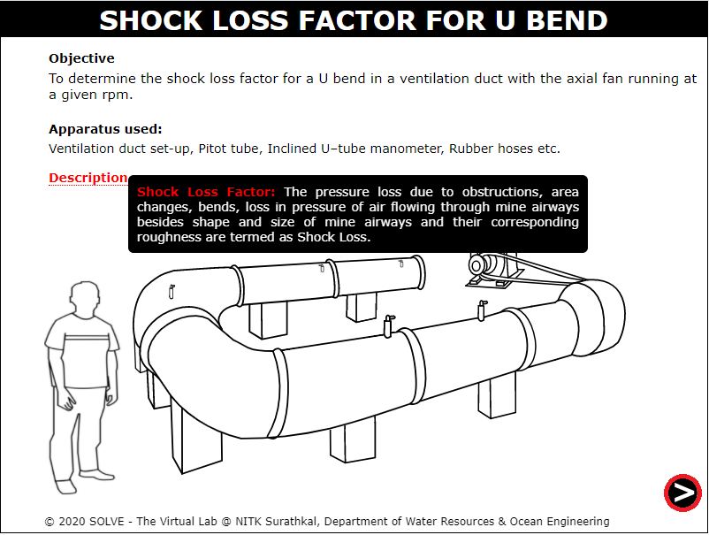 

2. Click on the slider to rotate so that current flows through the circuit board. 
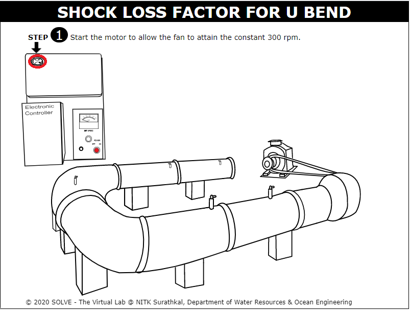 

3. Click on the power button to start the motor.  
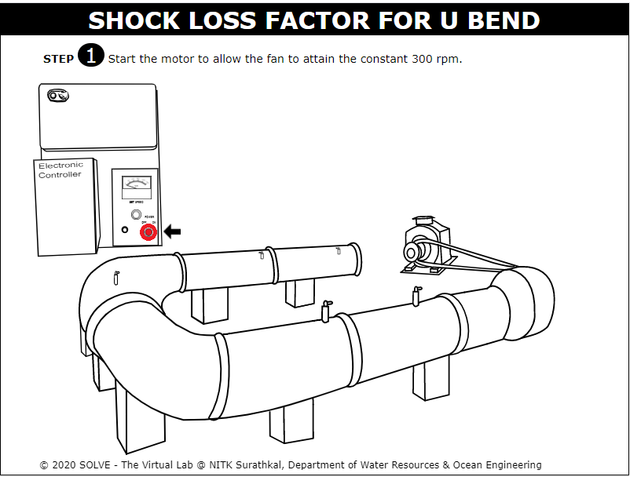 

4. Click on the knob to set the motor to 300rpm.  
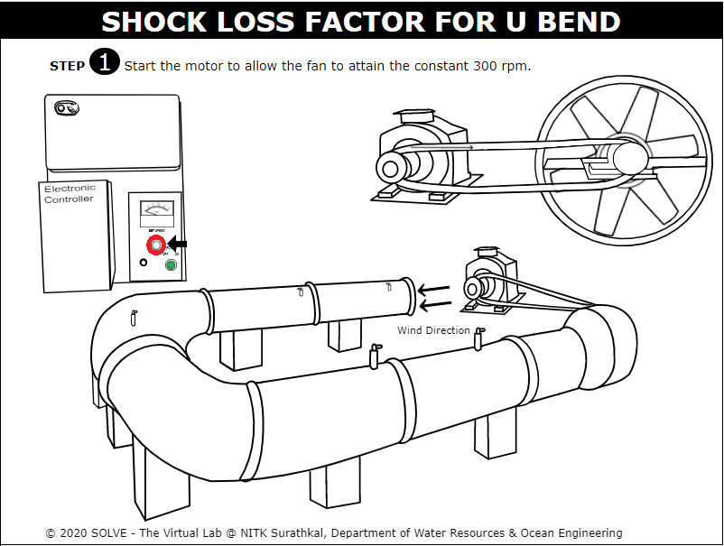 

5. Click on the hand to measure the inclination of manometer. 
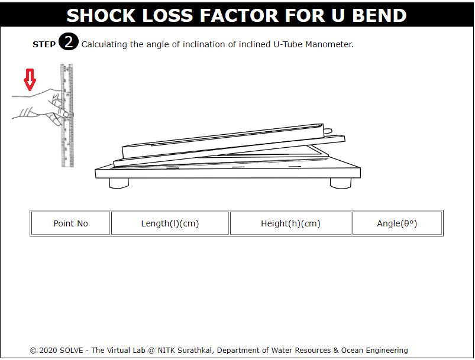 

6. Click on the NEXT button at the bottom right corner to proceed to the next step. 
 

7. Measure the length between the two chosen points and the diameter of the ventilation duct. 
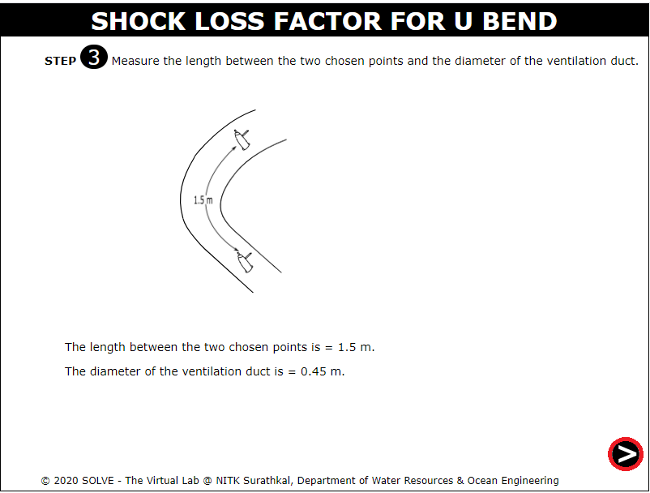 

8. Take the following precautions before noting down the reading. And click on the OK button to continue the experiment. 
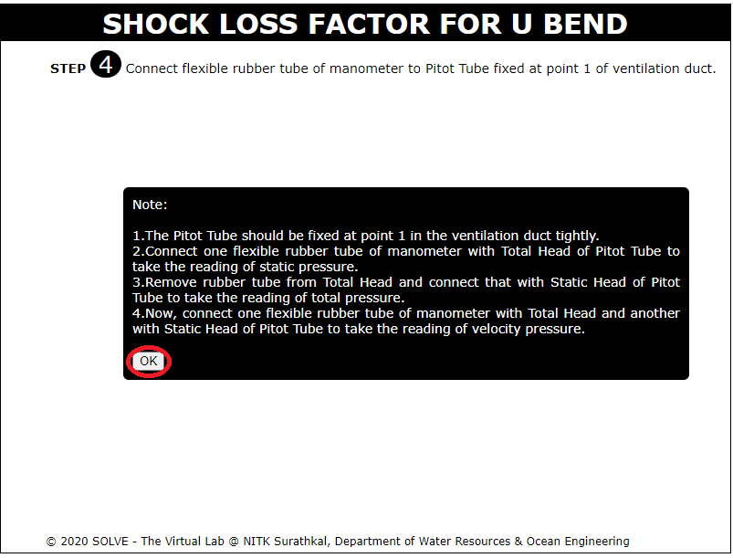 

9. Click on the hand to connect the rubber tube of manometer with pitot tube at point 1. 
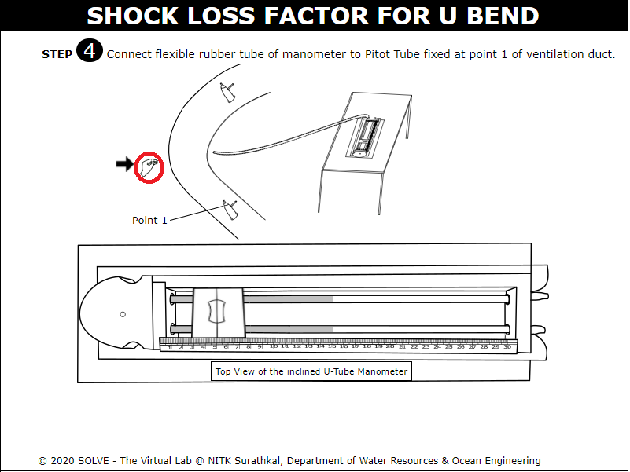 

10. Click on the mover to note down the static head reading from the manometer. 
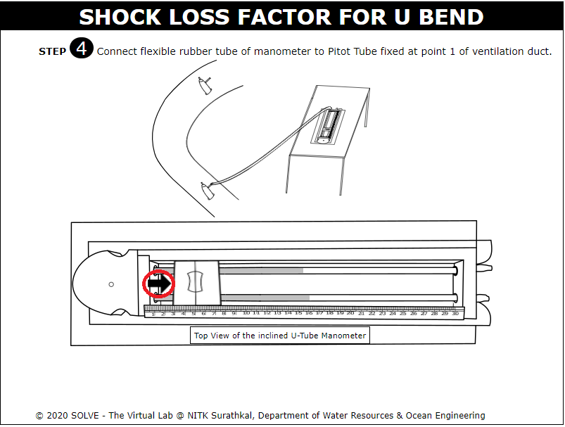 

11. Now connect the rubber tube to pitot tubes total head and note down the reading. 
 

12. Further, connect the rubber tube to pitot tubes velocity head and note down the reading.  
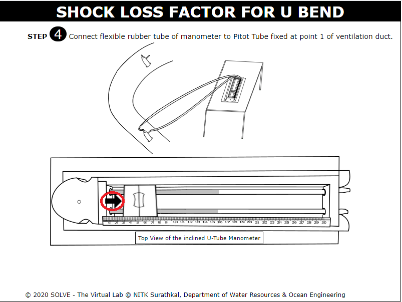 

13. Click on the NEXT button at the bottom right corner to proceed to the next step. 
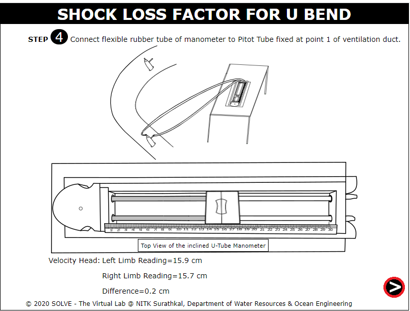 

14. Prepare the observation table for the experiment. Check the results by entering the calculated data. 
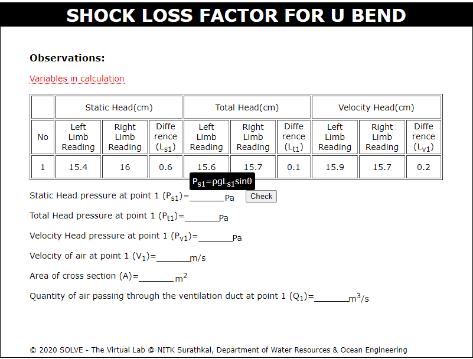 

15. Click on the NEXT button at the bottom right corner to proceed to the next step. 
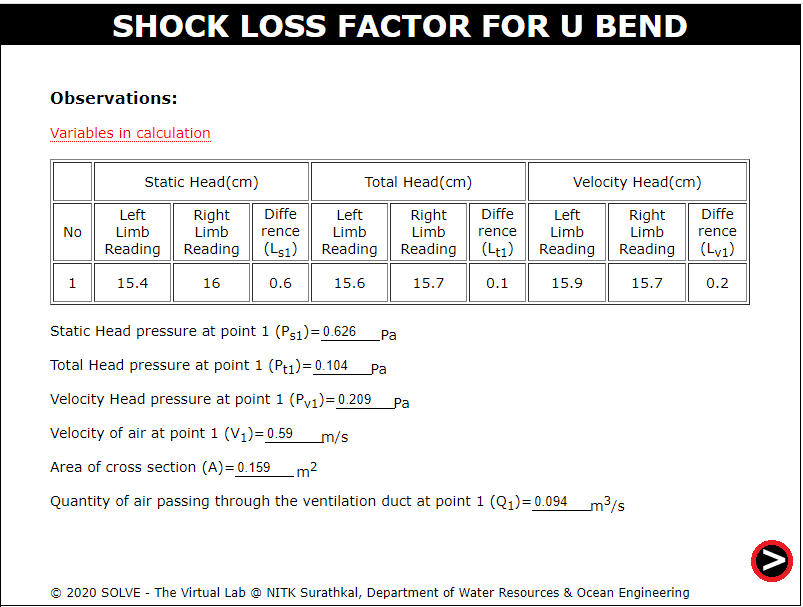 

16. Connect the rubber tube of manometer with pitot tube at point 2. Click on the mover to note down the static head reading from the manometer. 
 

17.  Now connect the rubber tube to pitot tubes total head and note down the reading. 
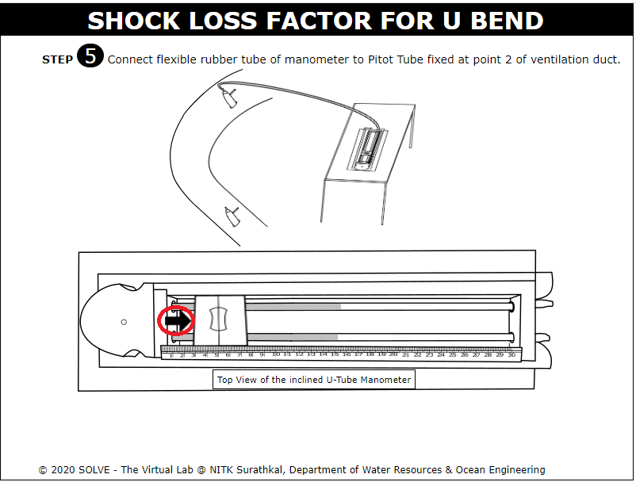 

18.  Further, connect the rubber tube to pitot tubes velocity head and note down the reading. 
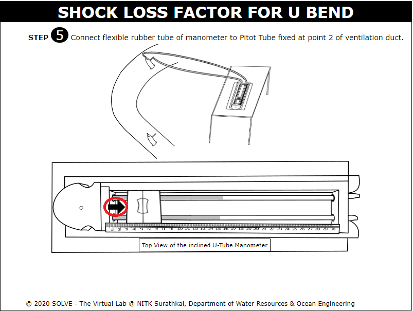 

19. Click on the NEXT button at the bottom right corner to proceed to the next step. 
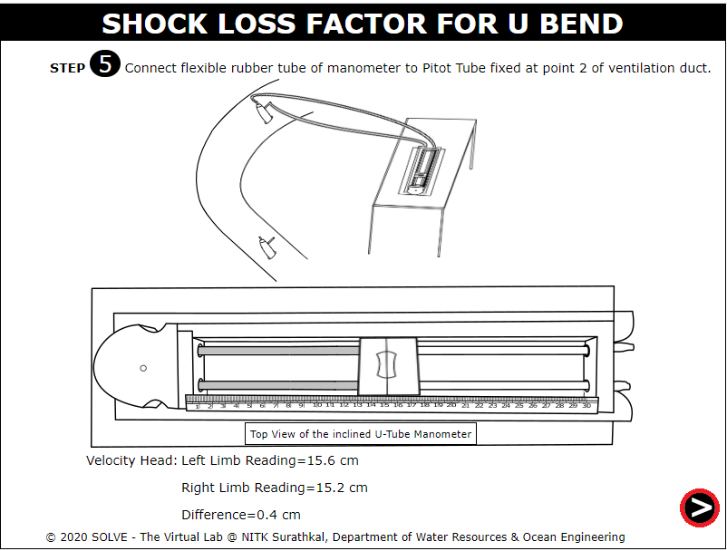 

20. The observation for point 2 is given below. Enter the required value in the input box provided to evaluate the results. 
 

21. Click on the NEXT button at the bottom right corner to proceed to the next step. 
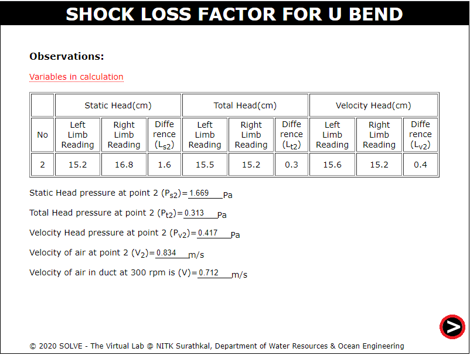 

22. Click on the NEXT button at the bottom right corner to proceed to the next step. 
 

23. Results is being displayed. 
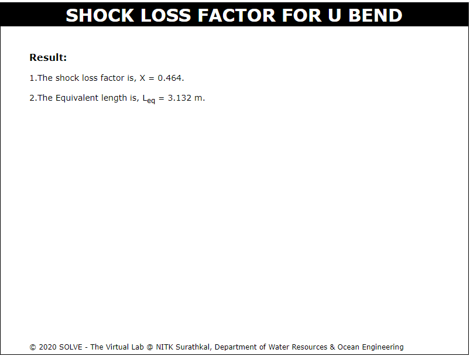 

